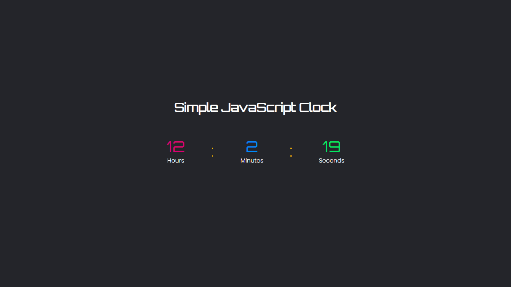

<h1 align="center">JavaScript Clock</h1>

## Simple Digital Style Clock in JavaScript
[](https://forthebadge.com)
[](https://forthebadge.com)
[](https://forthebadge.com)

## Preview:


## Time Format: `12 hours` clock format.

## Fonts Used
  - #### <a href="https://fonts.google.com/specimen/Poppins">`Poppins`</a>
  - #### <a href="https://fonts.google.com/specimen/Orbitron">`Orbitron`</a>

## Colors Used

- ####  ``#04E762``
- ####  ```#F5B700```
- ####  `#DC0073`
- ####  `#008BF8`
- ####  `#89FC00`
